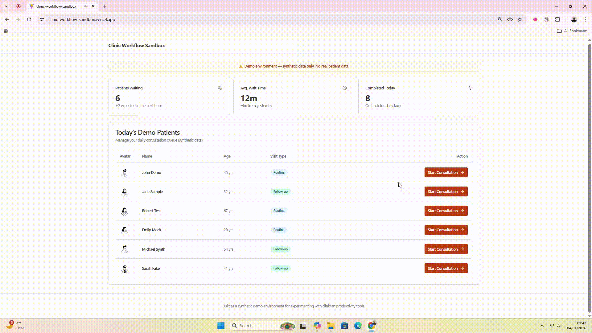

# Quick Clinical Notes

**Quick Clinical Notes** is a lightweight Chrome extension for fast, distraction-free clinical note capture—built to support clinicians during live reviews without interrupting workflow.

This project is independently designed, built, and maintained as part of a public Chrome Extension-a-Day challenge focused on clinician productivity tools
## Demo Environment

This demo was recorded using a **synthetic clinic workflow sandbox** created for demonstration purposes.

- All data shown is synthetic
- No real patient data is used, stored, or processed
- Not connected to any clinical or NHS system

## Features

- Minimal popup interface for rapid note capture  
- Automatic timestamps for clinical context  
- Local-only storage (no cloud, no sync)  
- One-click copy to clipboard  
- Export notes as a `.txt` file  

---

## Privacy & Data

Privacy-by-design.

- No tracking  
- No analytics  
- No cloud sync  
- All notes remain on the user’s device  

---

## Installation (Developer Mode)

1. Open `chrome://extensions`  
2. Enable **Developer Mode**  
3. Click **Load unpacked**  
4. Select the project folder  

---

## Use Cases

- Clinical reviews  
- Ward rounds  
- Patient follow-ups  
- Temporary notes alongside clinical documentation workflows (demo)  

---

## Technical Notes

- Built using standard Chrome Extension APIs (Manifest V3)  
- Service worker–based background logic  
- Local storage only (no external dependencies)  

---

## Status

Actively developed and iterated in public as part of a daily Chrome extension build challenge.
